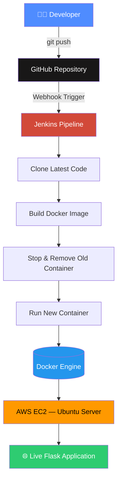
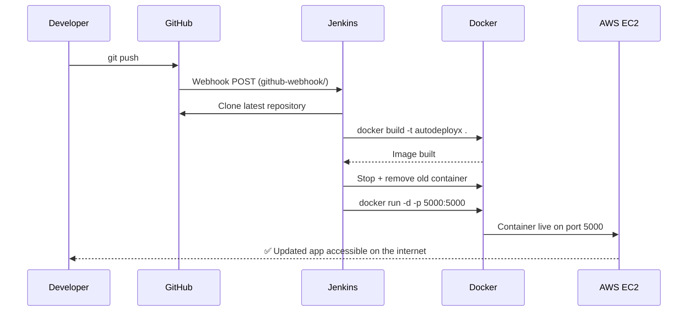

# AutoDeployX

### End-to-End CI/CD Pipeline — Jenkins • Docker • AWS EC2 • GitHub Webhooks

Push code to GitHub and watch it go live on a cloud server automatically — no manual SSH, no manual rebuilds, no manual restarts.

<p align="left">
  
  
  
  
  
  
  
</p>

---

## 📌 Overview

**AutoDeployX** is a hands-on DevOps project that automates the full journey of an application from a developer's laptop to a live server on the internet.

Traditionally, shipping a code change means logging into a server, pulling the latest code, rebuilding the app, restarting it, and hoping nothing broke — all by hand. This project replaces every one of those manual steps with an automated pipeline triggered by a single `git push`.

**In one line:** commit → push → Jenkins wakes up → Docker rebuilds → the live app updates itself on AWS EC2.

---

## 🎯 Problem This Solves

| Manual Deployment | AutoDeployX |
|---|---|
| SSH into server every time | Zero manual server access |
| Rebuild & restart by hand | Auto-rebuilt and redeployed |
| Easy to forget a step | Same steps run every time, identically |
| Slow, doesn't scale | Seconds from push to live |
| Hard to reproduce environment | Fully containerized with Docker |

---

## 🏗️ Architecture



---

## 🔄 CI/CD Flow, Step by Step



**Stage-by-stage breakdown:**

1. **Clone Repository** — Jenkins pulls the latest commit from GitHub
2. **Build Docker Image** — `docker build -t autodeployx .` packages the app + dependencies + runtime
3. **Stop Old Container** — the previously running container is stopped and removed
4. **Deploy New Container** — a fresh container is started from the new image
5. **Live on EC2** — the updated Flask app is instantly reachable on the public IP

---

## 🛠️ Tech Stack

| Layer | Technology | Purpose |
|---|---|---|
| Language | Python 3.11 | Backend logic |
| Framework | Flask | Lightweight web app / API |
| Containerization | Docker | Consistent, portable runtime |
| CI/CD Server | Jenkins | Automates build & deploy |
| Trigger | GitHub Webhooks | Push-to-deploy automation |
| Cloud Hosting | AWS EC2 (Ubuntu) | Public server the app runs on |
| Version Control | Git & GitHub | Source of truth, history |
| Scripting | Bash | Glue commands inside the pipeline |

---

## 📂 Project Structure

```
autodeployx/
├── app.py                 # Flask application
├── requirements.txt       # Python dependencies
├── Dockerfile             # Image build instructions
├── Jenkinsfile            # CI/CD pipeline definition
├── screenshots/           # Pipeline & deployment proof
└── README.md
```

---

## 📦 Dockerfile

```dockerfile
FROM python:3.11-slim
WORKDIR /app
COPY requirements.txt .
RUN pip install -r requirements.txt
COPY . .
EXPOSE 5000
CMD ["python", "app.py"]
```

| Instruction | What it does |
|---|---|
| `FROM python:3.11-slim` | Starts from a lightweight official Python image |
| `WORKDIR /app` | Sets the working directory inside the container |
| `COPY requirements.txt .` | Copies dependency list into the image |
| `RUN pip install -r requirements.txt` | Installs Flask and dependencies |
| `COPY . .` | Copies the rest of the project files |
| `EXPOSE 5000` | Documents that the app listens on port 5000 |
| `CMD ["python", "app.py"]` | Starts the app when the container runs |

---

## ⚙️ Jenkins Pipeline

```groovy
pipeline {
    agent any
    stages {
        stage('Clone Repository') {
            steps {
                git 'https://github.com/satyamchavan-dev/autodeployx.git'
            }
        }
        stage('Build Docker Image') {
            steps {
                sh 'docker build -t autodeployx .'
            }
        }
        stage('Stop Old Container') {
            steps {
                sh 'docker stop autodeployx-container || true'
                sh 'docker rm autodeployx-container || true'
            }
        }
        stage('Run New Container') {
            steps {
                sh 'docker run -d -p 5000:5000 --name autodeployx-container autodeployx'
            }
        }
    }
}
```

**GitHub Webhook configuration**

| Setting | Value |
|---|---|
| Payload URL | `http://<EC2-Public-IP>:8080/github-webhook/` |
| Content type | `application/json` |
| Trigger event | `push` |

---

## 🚀 Getting Started Locally

```bash
# 1. Clone the repository
git clone https://github.com/satyamchavan-dev/autodeployx.git
cd autodeployx

# 2. Create and activate a virtual environment
python -m venv .venv
source .venv/Scripts/activate      # Windows (Git Bash)
# source .venv/bin/activate        # macOS/Linux

# 3. Install dependencies
pip install -r requirements.txt

# 4. Run the app
python app.py
```

Visit **http://localhost:5000**

### Run with Docker

```bash
docker build -t autodeployx .
docker run -p 5000:5000 autodeployx
```

**Ports used**

| Service | Port |
|---|---|
| Flask App | `5000` |
| Jenkins Dashboard | `8080` |

---


---

## 🐞 Challenges & Fixes

| Issue | Root Cause | Fix |
|---|---|---|
| GitHub auth failure | Personal Access Token expired | Regenerated PAT, updated remote |
| `main` vs `master` mismatch | Branch naming inconsistency | Standardized branch name across Git & Jenkins |
| Docker container exit code 137 | Container ran out of memory | Adjusted resource limits / cleaned up images |
| Jenkins couldn't run Docker | `jenkins` user lacked Docker permissions | `usermod -aG docker jenkins` |
| Node went offline | EC2 disk space below threshold | `docker system prune -a -f`, cleared `/tmp`, restarted Jenkins |
| Webhook stopped firing | EC2 public IP changed after restart | Updated webhook payload URL |

---

## 🎤 Interview Q&A Cheat Sheet

<details>
<summary><b>What is Docker and why use it?</b></summary>
<br>
Docker is a containerization platform that packages an application with its dependencies and runtime into an isolated container, so it behaves identically on any machine — solving the classic "works on my machine" problem.
</details>

<details>
<summary><b>Difference between a Docker image and a container?</b></summary>
<br>
An image is a static blueprint/template. A container is a running instance of that image — the same relationship as a class and an object.
</details>

<details>
<summary><b>What does <code>-p 5000:5000</code> mean?</b></summary>
<br>
Port mapping in the format <code>HOST_PORT:CONTAINER_PORT</code>. It connects a port on the host machine to a port inside the container so the app is reachable from outside.
</details>

<details>
<summary><b>What is a GitHub Webhook and why is it needed?</b></summary>
<br>
A webhook is an HTTP callback GitHub sends to Jenkins the instant code is pushed, instantly triggering the pipeline — instead of someone manually clicking "Build Now."
</details>

<details>
<summary><b>What is CI/CD?</b></summary>
<br>
Continuous Integration is developers frequently merging code into a shared repository. Continuous Deployment is automatically shipping every validated change straight to production without manual steps.
</details>

---

## 🎯 Roadmap

- [ ] Kubernetes deployment
- [ ] Nginx reverse proxy + HTTPS (SSL)
- [ ] Terraform for infrastructure provisioning
- [ ] Monitoring with Prometheus & Grafana
- [ ] Multi-stage Docker builds
- [ ] GitHub Actions as an alternative CI trigger
- [ ] AWS Load Balancer + Auto Scaling

---

## 👨‍💻 Author

**Satyam Chavan**
Aspiring Cloud & DevOps Engineer — AWS · Docker · Jenkins · Linux · Terraform · Kubernetes · CI/CD

[GitHub](https://github.com/satyamchavan-dev) • [LinkedIn](www.linkedin.com/in/satyamchavan888)

---

⭐ **If this project helped you understand CI/CD, consider starring the repo!**
